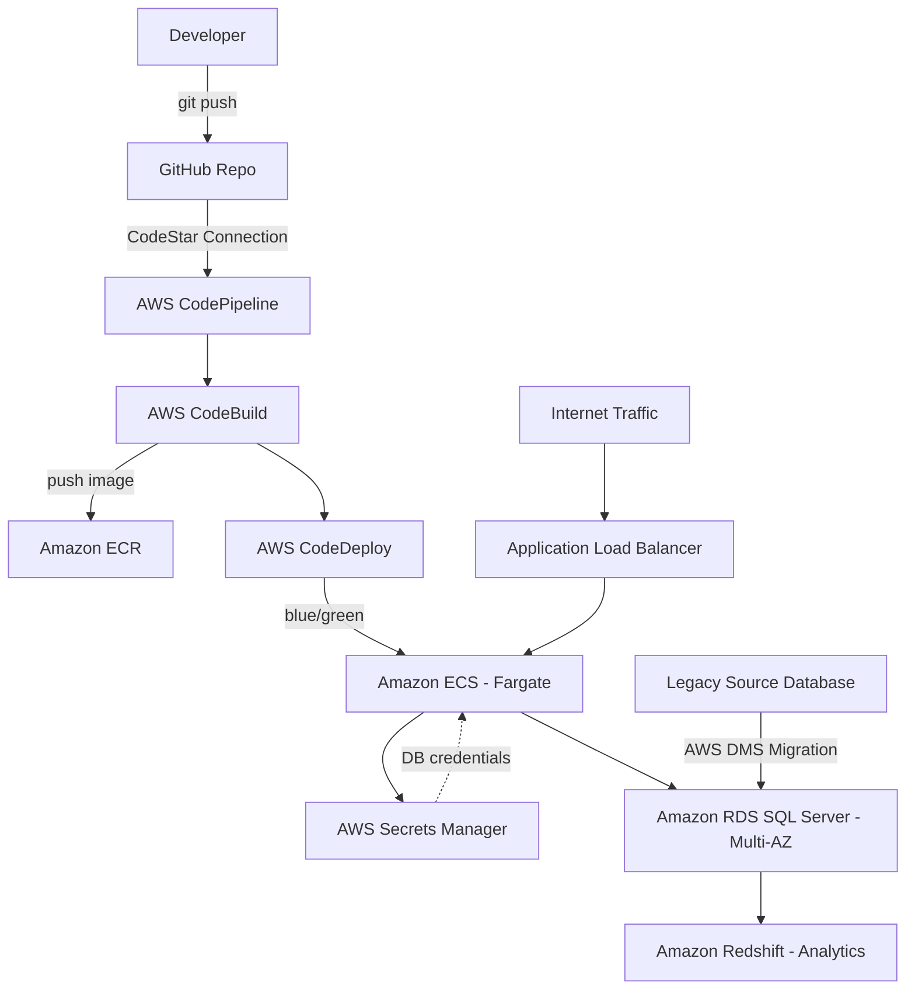

# Olive & Olive — Client Portal & Data Platform Modernization

## Overview

This project modernizes Olive & Olive's legacy .NET client portal and its underlying SQL Server database into a fully managed, containerized, and automated platform on AWS. It was built to satisfy two combined solution briefs — **Client Portal & Service Platform Modernization** and **SQL Server Database & Analytics Modernization** — delivered as a single, working deployment rather than two separate exercises.

The result is a client portal application that runs on a supported, current .NET runtime; is built, tested, and deployed automatically through a CI/CD pipeline; and is backed by a highly available, encrypted, and monitored database layer, with a dedicated analytics environment for reporting.

Everything in this repository — infrastructure and application code — is real and functional, including an end-to-end database migration from a legacy source database into the modernized environment.

---

## What This Solution Does

- **Modernizes the application runtime.** The client portal runs on .NET 8, containerized with Docker, rather than an older, unsupported .NET Framework version.
- **Automates deployment.** Every code change pushed to the application's GitHub repository triggers an automated pipeline: build the container image, push it to a private registry, and deploy it using a zero-downtime blue/green strategy.
- **Modernizes the database.** The application's SQL Server database runs on Amazon RDS with Multi-AZ high availability, automated backups, and encryption at rest — instead of a self-managed SQL Server instance.
- **Migrates existing data.** A legacy source database is migrated into the modernized database using AWS Database Migration Service, demonstrating the full cutover path a real migration would follow.
- **Adds analytics capability.** A separate Amazon Redshift cluster is provisioned for reporting and business intelligence workloads, kept apart from the transactional database so analytical queries don't compete with live application traffic.
- **Monitors the whole stack.** CloudWatch dashboards and alarms track application, database, and infrastructure health from one place.

---

## Architecture



---

## AWS Services Used

| Category | Services |
|---|---|
| Compute & Containers | Amazon ECS (Fargate), Amazon ECR, Application Load Balancer |
| Database & Analytics | Amazon RDS for SQL Server (Multi-AZ), Amazon Redshift, AWS Database Migration Service (DMS) |
| CI/CD | AWS CodePipeline, AWS CodeBuild, AWS CodeDeploy, GitHub (via CodeStar Connections) |
| Security & Secrets | AWS IAM, AWS KMS, AWS Secrets Manager |
| Networking | Amazon VPC, public/private subnets, NAT Gateway |
| Monitoring | Amazon CloudWatch (dashboards, alarms, log groups) |
| Infrastructure as Code | Terraform |

---

## Repository Structure

```
terraform/          Infrastructure as code (VPC, ECS, RDS, Redshift, DMS, CI/CD pipeline, IAM, monitoring)
olive-app/           Application source code (.NET 8 Web API), Dockerfile, and pipeline build/deploy config
```

The `terraform/` directory provisions every AWS resource this solution depends on. The `olive-app/` directory contains the actual client portal application that gets built and deployed through the pipeline defined in `terraform/cicd.tf`.

---

## Application

The client portal is a minimal ASP.NET Core 8 Web API exposing:

- `GET /` — health check endpoint (used by the load balancer)
- `GET /api/health/db` — confirms live connectivity to the database
- `GET /api/customers` — reads customer records from the modernized database

Database credentials are never hardcoded or passed as plain environment variables — the application retrieves them at runtime from AWS Secrets Manager via its ECS task role.

---

## Data Migration

A legacy SQL Server instance, seeded with initial customer data, stands in for Olive & Olive's original database. AWS DMS performs a full-load-and-CDC migration of that data into the modernized RDS instance, and the application serves that migrated data through its `/api/customers` endpoint — demonstrating a complete, verifiable migration path.

---

## Security Highlights

- All data at rest (database, analytics cluster, container registry, secrets, pipeline artifacts) is encrypted with a single customer-managed KMS key with automatic key rotation enabled.
- Database credentials are generated automatically by Terraform and stored only in Secrets Manager — no human ever sees or types the production password.
- The application and its production database run in private subnets with no direct internet access.
- IAM roles are scoped per service (application, build, pipeline, deployment) rather than sharing one broad role.
- Deployments use a blue/green strategy with automatic rollback if a new version fails health checks, so a bad release can't take down the live application.

---

## Status

This solution is fully deployed and operational: infrastructure provisioned via Terraform, the application built and deployed through the CI/CD pipeline, and the legacy-to-modern database migration completed and verified end to end.